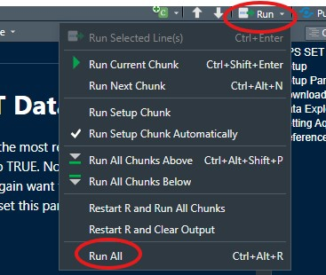
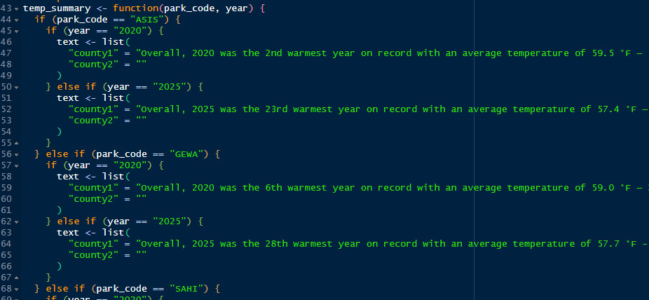

<!-- README.md is generated from README.Rmd. Please edit that file -->

# NCBN Weather & Climate Report Markdown Template

The goal of this markdown template is to allow for rapid and repeatable
analyses of annual weather and climate data for each NCBN park and
publication of results in a standardized annual report format.

### A Note about data for each park

Annual and historic temperature and precipitation data are downloaded
from NOAA NCEI:
<https://www.ncei.noaa.gov/access/monitoring/climate-at-a-glance/county/time-series>

Tide data are downloaded from NOAA Tides and Currents:
<https://tidesandcurrents.noaa.gov/map/index.html>

Wind data are downloaded from NOAA Tides and Currents. Or when wind data
are not available from Tides and Currents, wind data are downloaded from
NOAA NCEI.

Note that COLO and GATE span two counties, thus the template will output
two paragraphs (one for each county) for several of the sections.

See the download data section below for station info and/or links to
each data set.

## 1. Setup

1.  Download the NCBN Weather & Climate Reports repository from github -
    <https://github.com/laura-feher/Weather>.
2.  Click the green ‘Code’ button on the upper right and select
    ‘Download ZIP’. Then unzip the folder.
3.  Open the repository in Rstudio by double-clicking on the file called
    ‘Weather.Rproj’.
4.  Double click on the NCBN_weather_report_template.Rmd file to open it
    in Rstudio.

## 2. Set Parameters

Each time you want to analyze data or produce a new annual report,
you’ll need to set some variables (hereafter referred to as parameters)
in the header of the Rmd template file.

These parameters live at the bottom of the first block of the template
file (the YAML block; see example below) and should be set as follows:

- park_code: The capitalized 4 letter park code - e.g. “ASIS”

- year_to_assess: The year to produce the report for - e.g. “2025”

<figure>

<figcaption aria-hidden="true">Setting parameters before running the
report</figcaption>
</figure>

## 3. Download Data

- Temperature and Precipitation: The code in the report template will
  automatically download the required temperature and precipitation from
  NOAA NCEI (see the chunk “download-weather-data”).

- Annual tide data need to be downloaded manually for each park. See the
  instructions in the chunk “tides-fig-county1” and “tides-fig-county2”.
  Note that there is no tide data for THST because it is not coastal.
  Tide data can be downloaded from the following NOAA Tides and Currents
  stations:

| Park | County | NOAA Tides and Currents station |
|----|----|----|
| ASIS | Worcester County, MD | 8570283 |
| CACO | Barnstable County, MA | 8443970 |
| COLO | James City County, VA | 8638610 |
| COLO | York County, VA | 8637689 |
| FIIS | Suffolk County, NY | 8531680 |
| GATE | Kings County, NY | NA (tides data not available from this station) |
| GATE | Monmouth County, NJ | 8531680 |
| GEWA | Westmoreland County, VA | 8635027 |
| SAHI | Nassau County, NY | 8516945 |
| THST | Charles County, MD | NA |

Tide data stations

- Annual wind data are automatically downloaded from the same NOAA Tides
  and Currents stations in the previous table with the exception of CACO
  and COLO county1. For those parks, wind data are downloaded manually
  from NOAA NCEI via the links in the table below. See the instructions
  in the chunk “wind-text” and “tides-fig-county2”.

  | Park | County | NOAA NCEI download link |
  |----|----|----|
  | CACO | Barnstable, MA | <https://www.ncei.noaa.gov/access/search/data-search/local-climatological-data-v2?stations=USW00014765> |
  | COLO | James City County, VA | <https://www.ncei.noaa.gov/access/search/data-search/local-climatological-data-v2?stations=USW00003730> |

  Additional wind data sources

## 4. Data Exploration & Analysis: Running the template as chunks

Before you create a report from the template, you’ll want to run all of
the ‘chunks’ (the individual code blocks) and examine the results since
some of the report text will need to be changed/updated manually
depending on the results (see next step). Note that this assumes you
have already set the parameters in the previous step. You can run all
chunks in the report by clicking the drop-down next to the ‘Run’ button
at the top right, then click ‘Run All’:

<figure>

<figcaption aria-hidden="true">Use ‘Run All’ to run all code
chunks</figcaption>
</figure>

## 5. Update report text based on the results

A small amount of the text providing an interpretation of the results
will need to be updated manually each year that a new annual report is
created. This is info that is either not easily incorporated into an R
function or is based on expert interpretation of the results by I&M
biologists. This includes:

- A summary of the annual temperature results.

- A summary of the annual precipitation results.

To edit these:

1.  Within the top-level folder, navigate to the folder called ‘R’ and
    double-click the file named ‘format_text.R’

    1.  To edit the temperature summary paragraph(s):

        1.  Scroll down to the function called ‘temp_summary’.
        2.  Within this function, go to the section for the relevant
            park, find the if_else section for each year, and add
            another if_else section for the year to assess. Note that
            county2 will be blank for every park except COLO and GATE.
        3.  Use the temperature results from the thermometer image, the
            results in the data.frame
            ‘temp_rankings_county1’/‘temp_rankings_county2’, and the
            data.frame ‘park_monthly_avgs’ to update the text outputs.

    2.  To edit the precipitation summary paragraph(s):

        1.  Scroll down to the function called ‘precip_summary’.

        2.  Within this function, go the section for the relevant park,
            find the if_else section for each year, and add another
            if_else section for the year to assess. Note that county2
            will be blank for every park except COLO and GATE.

        3.  Use the precipitation results from the rain gauge image, the
            results in the data.frame
            ‘precip_rankings_count1’/‘precip_rankings_county2’, and the
            data.frame ‘park_monthly_avgs’ to update the text outputs.

<figure>

<figcaption aria-hidden="true">Edit the text results</figcaption>
</figure>

## 6. Create the annual report

Once you’ve finished exploring the results and updating the necessary
text, you can ‘knit’ the report to an html file that can be published on
NPS DataStore:

1.  At the top of the .Rmd template file, click on the ‘Knit’ icon with
    the ball of yarn.
2.  Once the report finishes rendering, there should be an .html file
    within the top-level Weather folder with the same name as the .Rmd
    template e.g., ‘NCBN_weather_report_template.html’.
3.  Rename the .html file to something more meaningful (e.g.,
    “ASIS_2025_Weather_Climate.html”). **Note that if you don’t rename
    this file, it will be overwritten each time you re-Knit the
    report.**

## 7. Upload the reports to NPS DataStore

1.  Go to the saved search for the NCBN Weather & Climate reports:
    <https://irma.nps.gov/DataStore/SavedSearch/Profile/5769>
2.  For each park, clone the entry from the previous year.
3.  Update the various fields with the new year and upload the html
    report file.
4.  Publish!
